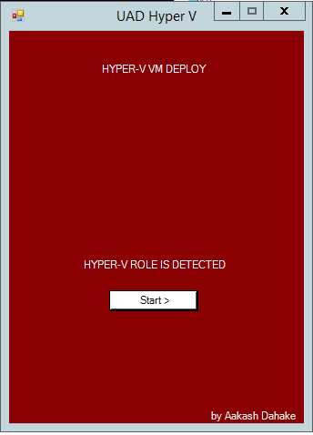
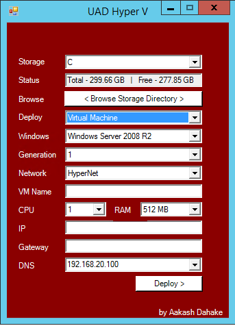

# HYPER-VM-DEPLOYER

This tool is developed to create a Hyper V VM using syspreped Windows virtual machine VHD on Hyper-V hypervisor.
It needs the host to be an Hyper V server.

How to use-
Copy this script to a Hyper-V and run.

Screenshots-

